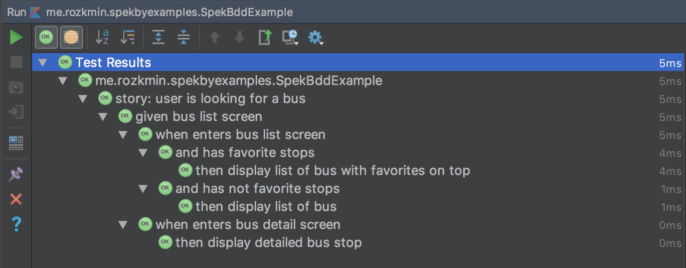

# Spek BDD Extensions
[](https://jitpack.io/#rozkminiacz/SpekBddDsl)

>only Spek 1.x is supported

## About
This library provides some extensions for [Spek](http://spekframework.org/), to match Behavior-Driven-Development specifications language.

| Spek BDD DSL         | Spek DSL |
|---:           | ---:      |
| Scenario      | group     |
| Story         | group     |
| Given         | group     |
| When          | group     |
| Then          | test      |
| And           | action    |

## Setup

```gradle
	allprojects {
		repositories {
			...
			maven { url 'https://jitpack.io' }
		}
	}
```

```gradle
	dependencies {
	        testCompile 'com.github.rozkminiacz:SpekBddDsl:1.0'
	}

```


## Example in code:




```kotlin
import me.rozkmin.spekbdd.BddDsl.And
import me.rozkmin.spekbdd.BddDsl.Given
import me.rozkmin.spekbdd.BddDsl.Story
import me.rozkmin.spekbdd.BddDsl.Then
import me.rozkmin.spekbdd.BddDsl.When
import org.jetbrains.spek.api.Spek

class SpekBddExample : Spek({
    Story("user is looking for a bus") {
        //setup context of a user
        Given("bus list screen") {
            When("enters bus list screen") {
                And("has favorite stops"){
                    Then("display list of bus with favorites on top") {
                        assertTrue(true)
                    }
                }
                And("has not favorite stops"){
                    Then("display list of bus") {
                        assertTrue(true)
                    }
                }
            }
            When("enters bus detail screen"){
                Then("display detailed bus stop"){
                    assertTrue(true)
                }
            }
        }
    }
})

```

## Disabling test groups
add `x` before method call - this will ignore specific test or container.
For example, don't want to test "user has favorite stops" yet, but we want to have full specification written:
```kotlin
class ManyCaseScenarioSample : Spek({
    Scenario("user is looking for a bus") {
        //setup context of a user
        Given("bus list screen") {
            When("enters bus list screen") {
                xAnd("has favorite stops", "not implemented yet") {
                    Then("display list of bus with favorites on top") {
                        assertTrue(true)
                    }
                }
                And("has not favorite stops") {
                    Then("display list of bus") {
                        assertTrue(true)
                    }
                }
            }
            When("enters bus detail screen") {
                Then("display detailed bus stop") {
                    assertTrue(true)
                }
            }
        }
    }
})
```

## Summary

Contributions are welcome
